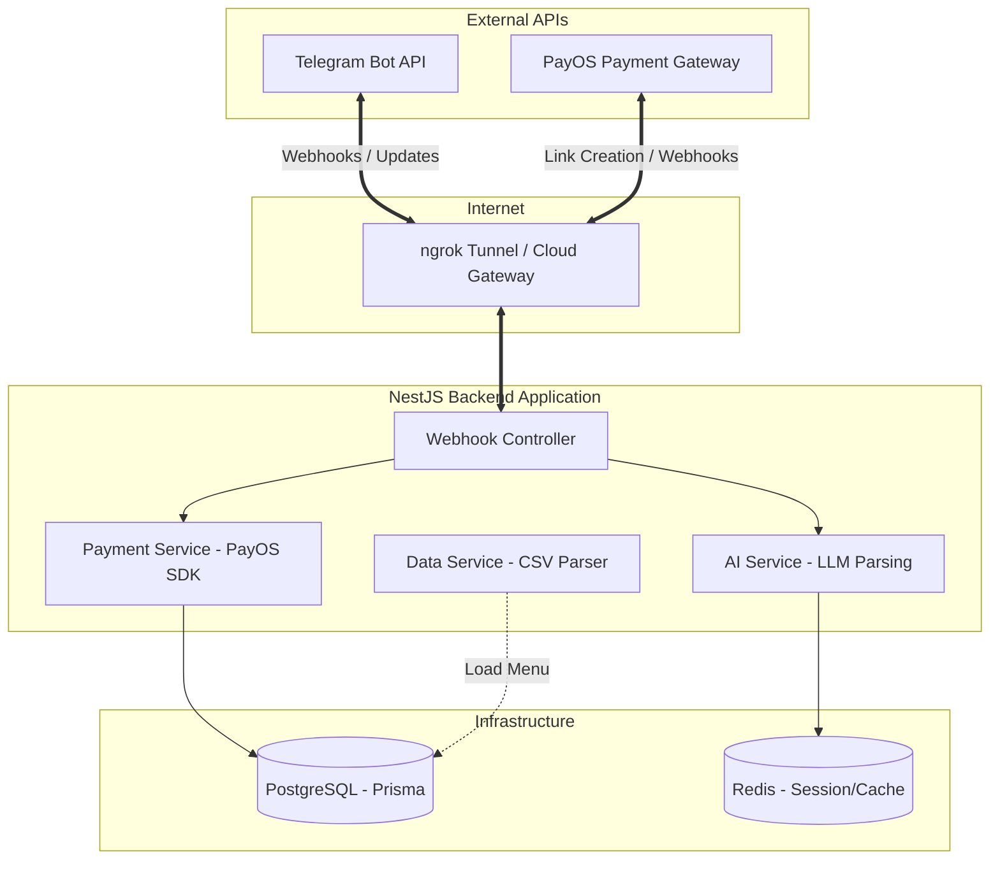

# Demo AI Bot — Bubble Tea Assistant (Telegram + PayOS)

This repository contains a NestJS backend that powers a Telegram + web assistant for a bubble-tea shop. The bot reads a CSV menu, uses an LLM to parse customer messages into structured orders, computes totals, creates PayOS checkout links, and verifies PayOS webhook notifications.

This README gives a step-by-step, terminal-first guide so someone unfamiliar with the code can start the project and reproduce the demo from development to a working Telegram webhook (local via ngrok).

**Assumptions**
- OS: Windows (PowerShell instructions provided). Bash/Linux/macOS commands are also shown where relevant.
- You have Git, Docker, and an internet connection.

---

**Quick overview**
- Backend: `backend/` (NestJS, TypeScript)
- Scripts: `backend/scripts/create_db.js` (create DB), `backend/scripts/send-webhook-test.js` (simulate PayOS webhook)
- Env: `backend/.env` (do not commit!). Use `backend/.env.example` as a template.

---

## Project analysis & architecture

This part summarizes the repository layout, the role of the main files, and the runtime request/payment flow so both developers and non-technical testers can understand how the pieces fit together.

- Purpose: a small demo assistant that accepts Telegram messages, parses them into structured orders with an LLM, creates PayOS checkout links, and verifies signed PayOS webhooks.

### Project layout (high level):

- `start-dev.ps1` — convenience PowerShell script: ensures Docker containers (Postgres + Redis), installs deps, runs Prisma generate/db push, optionally downloads/starts `ngrok`, starts the backend, attempts to register Telegram webhook, and prints the PayOS webhook URL (or attempts auto-registration if `PAYOS_REGISTER_URL` is provided).
- `backend/` — NestJS backend (main runtime):
	- `package.json` — scripts and deps.
	- `src/main.ts` — application bootstrap, reads env and starts server (default port 3001).
	- `src/telegram/telegram.controller.ts` — `POST /telegram/webhook` (receives Telegram updates, validates secret header, parses messages via `AIService`, and replies with a PayOS checkout link via `TelegramService`).
	- `src/payment/payment.controller.ts` — `POST /payment/create-link` (create checkout) and `POST /payment/webhook` (PayOS webhook receiver).
	- `src/payment/payment.service.ts` — builds canonical PayOS payload, signs with `PAYOS_WEBHOOK_SECRET`, posts to `PAYOS_BASE_URL`, persists payment/order records, and verifies incoming webhook signatures.
	- `src/ai/` — AI parsing service that converts free-text messages into structured order objects (used by `telegram.controller`).
	- `src/file/file.service.ts` — reads `backend/data/menu.csv` and helps resolve item prices.
	- `src/prisma/` — Prisma client wrapper and DB code.
	- `scripts/create_db.js` — helper to create/seed DB.
	- `scripts/send-webhook-test.js` — simulates PayOS sending a signed webhook to `/payment/webhook` (reads `PAYOS_WEBHOOK_SECRET` and supports `WEBHOOK_TARGET` to point at an ngrok URL).
- `frontend/` — a simple Next app with a chat UI (`app/page.tsx`, `components/ChatInterface.tsx`) that can interact with the backend and show payment status pages.

### Key environment variables used by the backend:

- `TELEGRAM_BOT_TOKEN`, `TELEGRAM_WEBHOOK_SECRET` — Telegram bot token and webhook secret (used to register and validate webhook calls).
- `PAYOS_BASE_URL`, `PAYOS_MERCHANT_ID`, `PAYOS_API_KEY`, `PAYOS_WEBHOOK_SECRET` — PayOS API + webhook signing key.
- `BACKEND_URL` — used to build the `notifyUrl` passed to PayOS; if not set the code falls back to `http://localhost:3001` (the `start-dev.ps1` script now attempts to set this to the ngrok public URL for the backend process).
- `FRONTEND_URL` — used to build `returnUrl`/`cancelUrl` in checkout.

### Main runtime flow (request sequence):

1. Developer runs `start-dev.ps1` (or starts services manually). The script brings up Postgres + Redis, runs `npm install`, runs Prisma generate/db push, starts `ngrok` (if available) and the backend, and prints the public URL(s).
2. A Telegram user sends a message to the bot. Telegram forwards the update to the webhook URL: `https://<ngrok-host>/telegram/webhook` (or your public `BACKEND_URL`).
3. `TelegramController.webhook` validates the secret header, extracts message text, and calls `AIService.parseOrder(text)` to convert natural language into a structured order.
4. The backend calls `PaymentService.createCheckoutLink(parsedOrder)` which:
	 - Resolves unit prices from `menu.csv` (via `FileService`),
	 - Computes canonical parameters, signs the payload with `PAYOS_WEBHOOK_SECRET`,
	 - Posts a payment request to `PAYOS_BASE_URL` using `PAYOS_MERCHANT_ID`/`PAYOS_API_KEY`,
	 - Persists a payment record (best-effort) and returns a `checkoutUrl`.
5. The backend sends the checkout URL back to the user chat (via `TelegramService`). The user pays using PayOS.
6. PayOS sends a signed webhook to `/payment/webhook`. `PaymentController.webhook` calls `PaymentService.verifyWebhook(body, signature)` to verify HMAC-SHA256 (sorting keys as required) and persists a `webhookLog` — the system can then mark payment/order as paid (see code path in `payment.service.ts`).

ASCII architecture (quick diagram):



### Developer notes / shortcuts

- To allow a non-technical friend to chat: ensure `backend/.env` contains `TELEGRAM_BOT_TOKEN` and `TELEGRAM_WEBHOOK_SECRET`, run `start-dev.ps1`, and the script will try to obtain an ngrok URL and register the Telegram webhook automatically. If ngrok isn't available the script prints the public URL that you must set in Telegram and/or PayOS.
- To test PayOS webhooks locally use:

```powershell
cd backend
# $env:WEBHOOK_TARGET = 'https://<ngrok-host>/payment/webhook'
node scripts/send-webhook-test.js
```

- If PayOS supports API-based webhook registration provide the API endpoint in your `.env` as `PAYOS_REGISTER_URL` and `PAYOS_API_KEY`; `start-dev.ps1` will attempt a registration call.

- Where to look first for debugging:
	- Backend logs: the backend window started by `start-dev.ps1`.
	- `backend/src/payment/payment.service.ts`: PayOS payload formatting, signing, and verification logic.
	- `backend/src/telegram/telegram.controller.ts`: how incoming messages turn into checkout links.

---

## FOR DEVELOPERS END TO END SETUP
### This project runs entirely local so make sure to follow steps below to setup the project

## 1) Clone the repo

Open PowerShell and run:

```powershell
git clone <REPO_URL> "demo-ai-bot"
cd "demo-ai-bot"
```

Replace `<REPO_URL>` with the repo URL.

## 2) Install prerequisites

Install Node.js (v18+). On Windows use `winget` (or `choco` if you prefer):

```powershell
winget install OpenJS.NodeJS.LTS
# or with Chocolatey:
# choco install nodejs-lts
```

Install Docker (Docker Desktop) so you can run Postgres and Redis:

```powershell
winget install -e --id Docker.DockerDesktop
```

Install `ngrok` (used to expose your local backend to Telegram). Recommended via winget:

```powershell
winget install --id=Ngrok.Ngrok -e
# or with Chocolatey:
# choco install ngrok
```

If you cannot use installers, download the `ngrok` binary and unzip it next to your shell path.

## 3) Start local infrastructure (Postgres + Redis)

Run these Docker commands to start Postgres and Redis (the backend expects Postgres on host port `55432` and Redis on `6379`):

```powershell
docker run --name demo-postgres -e POSTGRES_USER=demo -e POSTGRES_PASSWORD=secret -e POSTGRES_DB=demo -p 55432:5432 -d postgres:15

docker run --name demo-redis -p 6379:6379 -d redis:7
```

Check containers with `docker ps` and logs with `docker logs demo-postgres`.

## 4) Prepare backend environment

Copy the example env file and fill in secrets (PayOS, Telegram token, OpenAI/Google key):

```powershell
cd backend
copy .env.example .env
# Open backend/.env in a text editor and fill the values
```

- `OPENAI_API_KEY`: set your OpenAI key or Google API key (starts with `AIza`) if you want Gemini. If using Google, leave `GOOGLE_MODEL` as needed.
- `PAYOS_*`: merchant id / api key / webhook secret from PayOS account (for production). For testing you can use the demo values you already had.
- `TELEGRAM_BOT_TOKEN`: create a bot with BotFather and paste the token.
- `TELEGRAM_WEBHOOK_SECRET`: pick a random long secret (used to validate webhook requests from Telegram).

## 5) Install Node dependencies

From the repository root:

```powershell
cd backend
npm install

# If there's a frontend folder and you plan to run it locally
cd ../frontend
npm install
```

## 6) Prisma setup and DB migration

From `backend/`:

```powershell
npx prisma generate
npx prisma db push --accept-data-loss

# Optional: run the helper script to create DB or seed if present
node scripts/create_db.js
```

`create_db.js` checks `backend/.env` for DB connection details and will create the demo database if needed.

## 7) Build and start the backend

Development (live TypeScript execution):

```powershell
cd backend
npm run start
```

Production build and start:

```powershell
cd backend
npm run build
npm run start:prod
```

The server listens on `http://localhost:3001` by default.

## 8) Expose backend to the internet (ngrok) and set Telegram webhook

Start ngrok to forward to the backend:

```powershell
ngrok http 3001 --host-header=localhost
```

In another terminal, get the public forwarding URL (ngrok provides it in the terminal at Web Interface                 http://127.0.0.1:port_here), or query the local ngrok API:

```powershell
# Query the local ngrok API (default port is 4040). If that doesn't show tunnels, try 4041:
curl http://127.0.0.1:4040/api/tunnels
# If nothing returns, try:
# curl http://127.0.0.1:4041/api/tunnels
# Look for the `public_url` value, e.g. https://abcd-1234.ngrok-free.app
```

Register that URL as your Telegram webhook (replace placeholders):

```powershell
$env:TELEGRAM_BOT_TOKEN = "<your_bot_token>"
$env:TELEGRAM_WEBHOOK_SECRET = "<your_secret_token>"
# Try the ngrok API on 4040 first, fallback to 4041 if needed:
$ngrok = $null
try { $ngrok = (curl http://127.0.0.1:4040/api/tunnels | ConvertFrom-Json).tunnels[0].public_url } catch { }
if (-not $ngrok) { try { $ngrok = (curl http://127.0.0.1:4041/api/tunnels | ConvertFrom-Json).tunnels[0].public_url } catch { } }
curl -s "https://api.telegram.org/bot$($env:TELEGRAM_BOT_TOKEN)/setWebhook?url=$ngrok/telegram/webhook&secret_token=$($env:TELEGRAM_WEBHOOK_SECRET)"
```

Verify webhook info:

```powershell
curl "https://api.telegram.org/bot$($env:TELEGRAM_BOT_TOKEN)/getWebhookInfo"
```

## 9) Test the bot (simulate a Telegram user)

Send a test update to the webhook (PowerShell):

```powershell
$body = '{"update_id":1000000,"message":{"message_id":1,"from":{"id":12345,"is_bot":false,"first_name":"Tester"},"chat":{"id":12345,"type":"private"},"date":1650000000,"text":"Tôi muốn 1 ly Trà Sữa Trân Châu Đen L, thêm topping trân châu đen"}}'
Invoke-RestMethod -Uri 'http://localhost:3001/telegram/webhook' -Method POST -Headers @{'Content-Type'='application/json'; 'X-Telegram-Bot-Api-Secret-Token' = '<your_telegram_webhook_secret>' } -Body $body
```

Or post to the public ngrok URL so Telegram-style requests arrive exactly as they would from Telegram.

If everything works, the backend will call the AIService to parse the message, create an order, call PayOS to create a checkout link, and use the Telegram API to send the link to the user chat.

## 10) Simulate PayOS webhook (mark order as paid)

To simulate PayOS sending a signed webhook to your server, use the helper script (reads `PAYOS_WEBHOOK_SECRET` from `backend/.env`):

```powershell
cd backend
node scripts/send-webhook-test.js

# To target a public ngrok URL instead of localhost:
$env:WEBHOOK_TARGET = 'https://<your-ngrok-host>/payment/webhook'
node scripts/send-webhook-test.js
```

The script prints the canonical string, computed signature, and the server's response. The backend verifies the signature and persists the webhook result.

## 11) Troubleshooting & tips

- If the AI parsing fails with Google errors: make sure the API key in `OPENAI_API_KEY` is a valid Google AI Studio key (starts with `AIza`) and that `GOOGLE_MODEL` is set to a model your project is allowed to use. Alternatively, you can use a working OpenAI key.
- If PayOS calls fail, check `PAYOS_API_KEY` and `PAYOS_MERCHANT_ID` in your `.env`.
- If Telegram messages don't appear, check `getWebhookInfo` and the backend logs to ensure incoming updates are received.
- For local testing without Telegram, use the curl/Invoke-RestMethod examples above.

## 12) Useful commands summary

```powershell
# Start infra
docker run --name demo-postgres -e POSTGRES_USER=demo -e POSTGRES_PASSWORD=secret -e POSTGRES_DB=demo -p 55432:5432 -d postgres:15
docker run --name demo-redis -p 6379:6379 -d redis:7

# Install backend deps
cd backend
npm install

# Prepare DB
npx prisma generate
npx prisma db push --accept-data-loss
node scripts/create_db.js

# Start backend (dev)
npm run start

# Expose with ngrok
ngrok http 3001 --host-header=localhost

# Set Telegram webhook (example)
curl "https://api.telegram.org/bot<YOUR_TOKEN>/setWebhook?url=<NGROK_URL>/telegram/webhook&secret_token=<SECRET>"

# Simulate PayOS webhook
node scripts/send-webhook-test.js
```

---

## Run the full setup script (PowerShell)

A convenience script `start-dev.ps1` is included to automate the full local setup: starts Docker containers (Postgres + Redis), installs dependencies, runs Prisma commands, starts the backend, launches `ngrok` (if installed), and attempts to register the Telegram webhook.

1. Make sure `backend/.env` exists and is filled (copy from `backend/.env.example`).
2. Open PowerShell in the repository root.

Run the script (temporary bypass of execution policy):

```powershell
powershell -ExecutionPolicy Bypass -File .\start-dev.ps1
```

Or run interactively (temporary process scope bypass):

```powershell
Set-ExecutionPolicy -Scope Process -ExecutionPolicy Bypass
.\start-dev.ps1
```

To skip starting `ngrok` and webhook registration:

```powershell
.\start-dev.ps1 -SkipNgrok
```

Notes:
- The script opens new PowerShell windows for the backend and ngrok. Close those windows to stop the services.
- Ensure Docker Desktop is installed and running before starting the script. Download Docker Desktop and open it up.
- If ngrok is not installed or not in PATH, the script will attempt to download ngrok automatically; if the download fails it will continue but will not register the Telegram webhook automatically.
